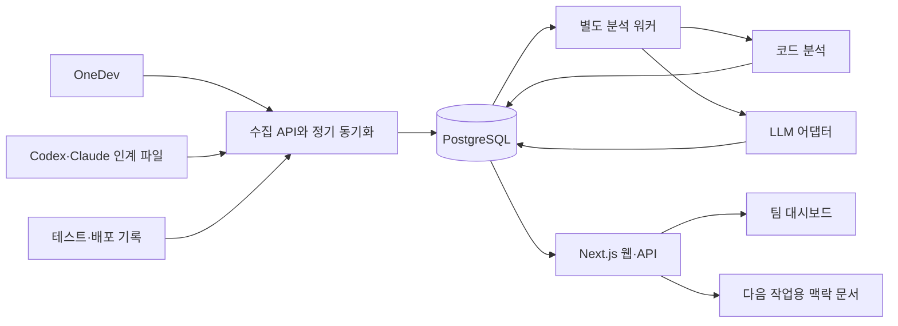

# AI 개발 인계실 — 상세 설계서

- 문서 버전: 0.1
- 작성일: 2026-09-13
- 상태: 검토용 초안. 구현 지시서나 완료된 기능 목록이 아님.
- 대상: 2~4명 개발팀, OneDev Git 관리, Codex·Claude 사용, Next.js 기반 AI 솔루션
- 제품명과 기술 구성 중 사용자가 확정하지 않은 항목은 본 문서의 설계 제안이다.

## 1. 문제와 목표

AI가 설계와 구현을 수행하면서 개발자가 직접 구현할 때 얻던 구조·결정·예외 처리에 대한 이해가 축적되지 않는다. 팀 환경에서는 다른 사람이 AI와 수행한 작업까지 추가되어 변경 맥락이 흩어진다. 결과적으로 낯선 기능의 긴급 수정, 리뷰, 배포 판단이 어려워진다.

이 제품은 개발자와 AI의 작업을 기능·코드·검증에 연결해 팀이 프로그램의 현재 상태를 이해하고 다음 작업에 필요한 맥락을 전달한다.

### 1.1 핵심 질문

1. 누가 어떤 문제를 어떤 방식으로 해결했는가?
2. 해당 변경이 현재 어느 브랜치와 배포 환경에 반영되어 있는가?
3. 이 기능의 진입점, 데이터 흐름, 외부 의존성은 무엇인가?
4. 관련 코드를 수정하면 무엇을 함께 확인해야 하는가?
5. 어떤 조건을 실제로 검증했으며 무엇이 미확인인가?
6. 다른 개발자나 AI에게 다음 작업을 맡길 때 무엇을 전달해야 하는가?

### 1.2 성공 기준

초기 파일럿에서 변경 10건 이상을 대상으로 기존 방식과 비교한다. 아래 수치는 출시 보장이 아닌 평가 목표다.

| 항목 | 측정 방법 | 초기 목표 |
|---|---|---|
| 인수인계 이해 | 비작성자가 목적·영향·미검증 조건을 설명 | 10건 중 8건 이상 |
| 수정 준비 시간 | 관련 코드와 검증 항목을 찾는 시간의 중앙값 | 기존 대비 30% 감소 |
| 사람 입력 부담 | 목적·결정·남은 일 보완 시간 | 작업당 중앙값 3분 이내 |
| 근거 추적 | 게시된 주요 사실에서 원문·버전으로 이동 가능 | 100% |
| 상태 정확성 | 병합·배포 상태 표본 대조 | 오표시 0건 |

도구가 모든 결함이나 영향을 탐지했다는 보장은 제공하지 않는다. 추출 가능한 범위와 미확인 영역을 함께 표시한다.

## 2. 범위와 우선순위

### 2.1 1차 출시 범위

- OneDev 인스턴스 하나 및 선택한 프로젝트 하나 연결.
- PR·커밋 수집, 작업 카드와 연결, 담당자 매핑.
- 목적·결정·변경·검증·남은 일로 구성된 인수인계 초안.
- 코드와 실행 결과에 근거를 연결하고 AI 추정을 구분.
- 팀 현황, 작업 상세, 검증 목록, 기능별 최근 변경.
- 선택한 작업의 관련 정보를 Codex·Claude에 전달할 맥락 문서 생성.
- TypeScript/JavaScript 직접 import 관계와 Next.js 라우트의 제한적 분석.
- 그래프 데이터 구조 및 작업 주변의 작은 그래프 조회. 상세 그래프 UI는 2차 범위.
- 배포 연동이 없으면 배포 여부를 미확인으로 표시.

### 2.2 2차 범위

- React Flow 기반 기능 지도와 변경 전후 비교.
- 다수 저장소, 연관 작업 충돌 후보, 배포 환경별 지도.
- 프롬프트·모델·검색 설정의 명시적 등록과 평가 결과 연결.
- Codex·Claude의 설치 환경에 맞는 자동 인계 연동.

### 2.3 3차 범위

- 실행 추적·로그 연동, 장애 조사 화면, 재현 절차 연결.
- 실제 요청 경로와 코드 기반 관계 비교.
- 반복되는 누락 조건 분석 및 그래프 저장소 필요성 재평가.

### 2.4 초기 제외

자동 코드 수정·병합·배포, 개발자 활동량 순위, 개인 AI 대화 전체 수집, 모든 언어와 프레임워크 분석, 전체 프로그램 안전 점수, 검증 없는 원인 확정은 제공하지 않는다.

## 3. 사용자와 접근 범위

| 역할 | 할 수 있는 일 |
|---|---|
| 관리자 | 프로젝트 연결, 권한 및 LLM 설정, 수집 범위 관리 |
| 개발자 | 작업 생성·편집, 결정 기록, 근거 보완, 인계 확인 |
| 열람자 | 허용된 프로젝트의 작업·지도·검증 조회 |

작업 담당자와 검토자는 별도 연결이며 역할과 독립적이다. 최초 연결은 관리자가 수행한다. OneDev 권한을 자동 동기화할 수 있는지는 설치 버전 확인 후 결정한다. 초기에는 명시적 프로젝트 회원 목록을 적용하고 원본 접근 권한보다 넓게 배포하지 않는다.

Git 작성자와 제품 사용자 연결은 명시적 매핑으로 관리한다. 이메일·이름이 비슷하다는 이유만으로 같은 사람으로 확정하지 않는다. 커밋 작성자만 보고 AI 사용 여부를 추정하지 않는다.

## 4. 주요 사용자 흐름

### 4.1 작업 시작

개발자가 목적·대상 기능을 입력해 작업 카드를 만든다. 이슈 연결은 선택 사항이다. 시스템은 관련 기능, 최근 병합 변경, 진행 중인 연관 작업, 반드시 지켜야 할 조건을 모은다. 사용자가 범위를 확인하면 버전과 근거가 포함된 맥락 문서를 생성한다.

### 4.2 AI와 개발

Codex·Claude에 맥락 문서를 전달한다. 작업 중 중요한 결정은 공통 양식으로 남긴다. 초기에는 파일 내보내기·가져오기 또는 API 제출을 지원하고, 자동 hook 동작은 설치된 도구 지원을 확인하기 전 가정하지 않는다.

### 4.3 PR과 인계 생성

PR을 작업 카드에 연결한다. 시스템은 기준 커밋과 대상 커밋의 차이를 수집하고 실제 코드와 인계 기록을 대조한다. AI 초안은 작성자가 확인하기 전 초안으로 표시한다. 새 커밋이 올라오면 변경 구간을 다시 분석하며 사람이 보완한 결정은 유지한다.

작업 카드가 없는 PR은 임시 카드로 생성할 수 있다. 기존 작업과의 자동 매칭은 후보를 제안하며 명시적 작업 ID 또는 사람이 확인한 연결을 우선한다.

### 4.4 리뷰와 검증

검토자는 변경 설명과 근거를 함께 확인한다. 테스트 결과는 실행한 커밋·환경·명령·결과에 연결한다. 기존 결과 이후 코드가 달라지면 재확인 상태를 표시한다. 인계 읽음, 설명 확인, 시나리오 검증 완료는 독립된 상태다.

### 4.5 병합과 배포

병합 이벤트로 기본 브랜치의 분석을 갱신한다. 배포는 별도의 배포 기록에 커밋 또는 명확히 해석 가능한 아티팩트를 연결한다. 병합만으로 배포 완료로 표시하지 않는다. 운영 환경의 버전이 확인되지 않으면 최신 코드 지도와 운영 지도 비교를 비활성화한다.

### 4.6 예시

개발자 A가 문서 분석 작업에 재시도를 추가하고 개발자 B가 업로드 화면을 수정한다. 도구는 공통 작업 상태 인터페이스가 변경됐다는 연결을 보여준다. A의 작업 카드에는 재시도 횟수, 실패 처리, 중복 저장의 검증 여부가 남는다. B는 화면의 대기·실패 상태 처리를 확인하고 자신의 검증 결과를 연결한다. 이후 담당자가 바뀌어도 작업 카드에서 코드와 결정 이유를 찾을 수 있다.

## 5. 화면 설계

### 5.1 팀 현황

프로젝트·기간·브랜치·기능 필터를 제공한다. 최근 변경, 내 작업과 연관된 변경, 인계 확인 요청, 검증 공백을 표시한다. 기본 정렬은 관련성과 최근 변경 시각이며 커밋 수에 따른 개인 순위를 만들지 않는다. 각 항목에는 담당자, 실제 반영 상태, 분석 기준 커밋, 근거 링크를 노출한다.

### 5.2 작업 상세

상단에 목적과 담당자, 상태를 표시한다. 본문은 변경 전후 동작, 결정 이유, 관련 코드, 영향 후보, 검증 표, 남은 일, 변경 이력 순서다. AI 초안과 사람 확인 여부를 분명히 구분한다. 근거 없는 문장은 추정 또는 미확인으로 표시한다.

### 5.3 기능 상세와 지도

사용자 기능을 진입점으로 화면 → 서버 처리 → 데이터·외부 서비스 관계를 탐색한다. 전체 노드를 한 번에 펼치지 않고 선택한 기능의 1~2단계 주변 관계를 기본 표시한다. 코드 import, 실제 호출 관찰, 사람이 지정한 연결, AI 제안을 서로 다른 관계 종류로 표시한다. import를 실행 호출로 표현하지 않는다.

### 5.4 검증 현황

기능별 동작 조건, 결과, 실행 버전, 확인 시각, 담당자, 근거, 재확인 사유를 표로 표시한다. 필터는 미검증·실패·재확인 필요·통과·적용 제외를 제공한다. 관련 테스트를 찾지 못한 상태와 테스트가 없다고 확인한 상태는 구분한다.

### 5.5 문제 조사: 후속 범위

증상·환경·배포 버전으로 범위를 제한하고 관련 실행 기록과 최근 변경을 제공한다. 결과는 확인된 사실, 원인 후보, 다음 확인 단계로 구성한다. 최근 변경이라는 이유만으로 원인으로 확정하지 않는다.

## 6. 시스템 구성



### 6.1 제안 기술 구성

| 구성 | 초기 제안 | 이유 |
|---|---|---|
| 웹·API | Next.js + TypeScript | 팀의 기존 기술과 일치 |
| 데이터 | PostgreSQL | 작업·권한·관계·이력의 일관된 관리 |
| 작업 처리 | 별도 Node.js 워커와 DB 작업 큐 | HTTP 요청과 긴 분석 분리 |
| 코드 분석 | TypeScript 컴파일러 API 기반 어댑터 | JS/TS 구조와 정적 참조 분석 |
| LLM | 공급자 교체 가능한 서버 측 어댑터 | 모델과 호출 정책 분리 |
| 그래프 UI | React Flow, 2차 도입 | 선택한 관계 주변 탐색 |
| 파일 | 초기 영속 볼륨, 확장 시 객체 저장소 | 원문·인계·보고서 보관 |

Next.js 요청 처리 안에서 장시간 분석을 실행하지 않는다. ORM, 큐 라이브러리, 정확한 패키지 버전은 구현 계획에서 호환성을 확인해 고정한다.

### 6.2 배포 제안

초기에는 웹, 워커, PostgreSQL을 분리된 프로세스 또는 컨테이너로 한 서버에서 운영한다. 소스 캐시는 워커만 접근하고, 저장소 자격 증명과 LLM 키는 서버 비밀 설정으로 관리한다. 네트워크·외부 LLM 반출 정책이 확인되기 전 실제 코드를 전송하지 않는다.

## 7. 데이터 모델

모든 프로젝트 데이터는 project_id로 범위를 제한한다. 외부 원본 ID와 제품 내부 ID를 분리하며 시각은 UTC로 저장한다.

| 엔터티 | 핵심 필드 |
|---|---|
| Project | id, name, repository_origin, default_branch, settings |
| Member | id, identity, project_id, role, external_identity_mapping |
| WorkItem | id, project_id, title, purpose, owner_id, review_state |
| WorkLink | work_id, source_type, source_id, linking_method |
| SourceEvent | source_key, event_type, payload_ref, received_at, processing_state |
| PullRequest | external_id, base_sha, head_sha, merged_sha, source_state |
| Commit | repository_id, sha, parents, author_identity, authored_at |
| Feature | id, project_id, name, description, owner_id |
| Decision | work_id, statement, rationale, alternatives, author_type, review_state |
| Claim | subject_id, text, claim_type, review_state, analysis_run_id |
| Evidence | kind, source_ref, commit_sha, path, symbol, line_start, line_end, content_hash |
| ClaimEvidence | claim_id, evidence_id, relation_type |
| Condition | feature_id, expected_behavior, origin, priority |
| VerificationRun | commit_sha, environment, command, outcome, executed_at, artifact_ref |
| ConditionResult | condition_id, verification_run_id, result, evidence_id |
| Deployment | environment, commit_sha, artifact_id, deployed_at, source_ref |
| GraphNode | id, project_id, kind, stable_key, metadata |
| GraphEdge | source_id, target_id, relation_type, provenance, evidence_id, snapshot_id |
| GraphSnapshot | repository_id, commit_sha, analyzer_version, completeness |
| AnalysisRun | input_hash, model_id, prompt_version, state, usage, error |
| HandoffRevision | work_id, revision, ai_draft, human_patch, source_head_sha |
| Job | dedupe_key, type, state, attempt, available_at, lease_until, last_error |
| AuditEvent | actor_id, action, subject_id, occurred_at |

### 7.1 상태 관리

작업 진행, PR 상태, 배포 상태는 서로 다른 필드·기록으로 보관한다. 작업 하나에 여러 PR이 연결될 수 있으므로 부분 병합·부분 배포를 표시할 수 있어야 한다. 화면의 요약 상태는 연결된 기록에서 산출한다.

분석 작업 상태는 queued → running → succeeded 또는 failed이며 재시도 대기 상태를 별도로 둔다. 인계 검토는 draft → reviewed이며 코드 변경 후에는 stale 표시를 추가한다. 원본 PR의 상태는 OneDev 값을 정규화해 보관하되 원래 값을 잃지 않는다.

## 8. 그래프 설계

### 8.1 노드와 관계

노드는 개발자, 작업, PR, 기능, 라우트, 코드 심벌, 파일, 데이터 자원, 외부 서비스, 프롬프트, 모델 설정, 테스트 조건이다.

관계는 담당함, 구현함, 변경함, import함, 정적 호출 후보, 데이터를 사용함, 검증함, 의존함, 실행에서 관찰됨으로 구분한다. 각 관계는 출처와 기준 커밋을 가진다. 원시 인접 관계와 사용자에게 제안하는 영향 후보를 같은 확정 관계로 저장하지 않는다.

### 8.2 저장 및 탐색

초기에는 GraphNode·GraphEdge·GraphSnapshot 테이블과 출발·도착 노드 인덱스로 저장한다. 탐색에는 깊이 제한, 방문 노드 중복 제거, 결과 수 제한을 적용한다. 기본 깊이는 2, API 최대 깊이는 5, 응답 노드 상한은 200으로 제안한다. 잘린 결과임을 표시하고 추가 탐색을 제공한다.

심벌의 키는 저장소·경로·심벌 식별자를 조합한다. 이름 변경·이동은 자동으로 동일성 확정하지 않으며 변경 매핑 근거가 부족하면 새 노드와 이전 노드 연결 후보로 표시한다. 관계는 해당 스냅샷 내에서 유효하며 서로 다른 브랜치의 관계를 섞지 않는다.

### 8.3 GraphDB 도입 기준

사용자 수만으로 GraphDB 도입 여부를 판단하지 않는다. 실제 데이터로 깊은 경로 탐색, 관계 패턴 질의, 쿼리 유지보수 부담을 측정한다. 인덱스와 조회 범위를 조정해도 목표 응답 시간을 지속적으로 넘기거나 복잡한 그래프 질의가 핵심 기능이 되면 Neo4j를 비교 평가한다. 처음부터 DB 이중 쓰기를 도입하지 않는다.

## 9. OneDev 수집과 정합성

실제 OneDev 버전, API 경로, 인증, webhook 이벤트·검증 방식, PR·빌드·배포 데이터 제공 범위는 설치 환경에서 확인해야 한다. 아래는 공급자 중립적 수집 계약이며 지원을 확인한 기능 목록이 아니다.

1. 최초 연결 시 선택한 저장소와 열린 PR, 최근 30일의 변경을 가져온다. 초기 기간은 설정 가능하다.
2. webhook이 지원·허용되면 수신 즉시 영속 이벤트를 저장한 후 응답한다. webhook이 없으면 정기 조회로 동작한다.
3. 정기 동기화는 누락 이벤트를 복구한다. 기본 5분 간격을 제안하며 API 제한에 맞춰 조정한다.
4. 중복 이벤트는 원본 ID 또는 이벤트 유형·원본 버전·페이로드 해시로 제거한다.
5. 순서가 뒤바뀐 이벤트는 현재 원본 상태를 다시 조회해 해소한다.
6. 분석 작업은 저장소·base_sha·head_sha·분석기 버전으로 중복 실행을 제어한다.
7. force push는 새 head를 별도 분석하며 이전 결과를 삭제하지 않고 이전 버전으로 표시한다.
8. 프로젝트 연결 해제 시 신규 수집을 중단한다. 보관·삭제는 관리자 설정에 따라 명시적으로 수행한다.

소스는 불변 커밋을 기준으로 읽는다. 분석을 위해 저장소의 설치 스크립트나 테스트를 자동 실행하지 않는다. 테스트는 CI 결과 가져오기를 우선하며 향후 실행 지원 시 격리 실행기와 별도 정책으로 분리한다.

## 10. Next.js 코드 분석 범위

App Router와 Pages Router의 사용 여부를 탐지하고 분석 결과에 기록한다. 초기에는 라우트 파일, 직접 import/export, 정적으로 해석 가능한 참조를 추출한다. 경로 alias는 프로젝트 설정으로 해석한다.

Server Action, 동적 import, 런타임 라우팅, ORM 모델, 외부 AI 호출은 코드 패턴과 명시적 설정으로 식별 가능한 범위만 지원한다. 모든 실행 흐름이 정적으로 결정된다고 가정하지 않는다. 미해석 참조 수와 분석 제외 파일을 결과에 포함한다.

AI 솔루션의 모델·프롬프트·검색 설정은 팀이 사용하는 구조를 확인한 후 어댑터를 추가한다. 벡터 DB나 특정 AI SDK를 사용한다고 가정하지 않는다.

분석 오류가 난 파일은 실패 상태로 남기고 전체 분석을 성공으로 위장하지 않는다. 부분 성공 결과에는 완전성 정보를 붙인다.

## 11. LLM 설계

### 11.1 역할

LLM은 수집된 사실을 요약하고 결정 기록을 구조화하며 영향·검증 누락 후보를 제안한다. PR·테스트·배포의 실제 상태를 결정하는 권한은 갖지 않는다.

단계는 입력 선별 → 구조화 초안 생성 → 근거 검증 → 게시용 초안 저장이다. 저장된 분석은 입력 해시·모델·프롬프트 버전을 통해 재현 가능한 맥락을 남긴다. 확률적 출력이므로 동일한 문장을 보장하지 않는다.

### 11.2 입력과 출력

입력은 목적, 결정 기록, 제한된 diff, 관련 코드, 관계, 테스트 결과, 기준 버전이다. 전체 저장소를 매 호출마다 넣지 않는다. 삭제·생성 파일, 바이너리, 생성물, 큰 파일은 별도 정책으로 처리하고 제외 범위를 표시한다.

출력 스키마는 summary, behavior_changes, decisions, impact_candidates, verification_gaps, claims, evidence_ids, limitations로 구성한다. 근거 ID는 입력에 존재하는 것만 허용하며 구조 검증 실패 시 게시하지 않는다. 문장과 인용된 코드의 의미 일치 여부는 사람의 검토가 필요할 수 있다.

### 11.3 사실과 추정

Claim 유형은 declared_intent, code_observation, execution_observation, inference, unknown이다. review_state는 unreviewed, accepted, disputed이며 이 둘을 혼합하지 않는다. 사람이 확인한 AI 추정도 실행으로 검증된 사실로 자동 승격하지 않는다.

사람의 결정 기록과 AI 요약이 다르면 충돌을 표시한다. 사람이 보완한 기록은 새 AI 결과와 별도 보관하고 병합 과정에서 삭제하지 않는다.

### 11.4 비용·실패·보안

프로젝트별 분석 입력·출력 토큰 상한과 월 예산을 설정한다. 초기 제안은 작업당 입력 20,000토큰, 출력 4,000토큰 이하이며 선택 모델과 실제 PR 규모에 맞춰 조정한다. 초과 diff는 분할 분석하고 최종 설명에 분할·제외 여부를 표시한다.

일시적 오류는 지수 지연으로 최대 3회 재시도한다. 지속 실패나 예산 초과 시 코드·테스트 원문은 계속 열람할 수 있고 AI 설명만 실패 또는 대기로 남긴다. 비용 집계는 공급자가 반환한 사용량과 설정 가격을 기준으로 추정하며 실제 청구와 구분한다.

코드·PR·인계 문서는 분석 대상 데이터로 취급한다. 그 안의 지시로 도구 실행이나 자격 증명 접근을 허용하지 않는다. 비밀정보 탐지·제외를 거친 선택 코드만 승인된 LLM 연결로 보낸다. 개발 도구 사용 권한과 서버의 LLM API 사용 권한은 별도 확인한다.

## 12. 인수인계와 맥락 문서 계약

공통 인계 형식은 JSON으로 검증하고 Markdown으로 표시한다.

```json
{
  "schemaVersion": "1.0",
  "workId": "work-example",
  "repositoryId": "repo-example",
  "baseSha": "<실제 기준 커밋 SHA>",
  "headSha": "<실제 대상 커밋 SHA>",
  "purpose": "문서 분석의 일시적 실패 복구",
  "changes": ["분석 재시도 추가"],
  "decisions": [{"choice": "재시도를 큐에서 수행", "reason": "요청 처리와 분리"}],
  "verificationRefs": [],
  "unverified": ["저장 직후 연결 종료 시 중복 처리"],
  "followUps": [],
  "producer": {"kind": "ai", "tool": "explicitly-declared"}
}
```

위 SHA 값은 형식 설명용이며 실제 제출에서는 존재하는 커밋과 저장소 일치 여부를 검증한다. AI가 테스트 통과를 텍스트로 제출해도 실행 근거가 없으면 선언으로만 보관한다.

맥락 문서는 목적, 대상 버전, 관련 기능, 합의된 조건, 최근 변경, 진행 중 연관 작업, 근거 링크, 미확인 영역을 포함한다. 생성 시점과 커밋을 기록하고 다음 사용 시 최신 여부를 확인한다. 초기에는 다운로드·복사로 제공하며 대화 자동 전송은 구현 범위에 포함하지 않는다.

## 13. 내부 API 초안

아래는 제품 내부 API 제안이며 OneDev API 경로가 아니다. 모든 조회·수정은 인증과 프로젝트 권한 검사를 거친다.

| 메서드·경로 | 용도 |
|---|---|
| POST /api/projects | 프로젝트 등록 |
| POST /api/projects/:id/sync | 수집 작업 등록, 202 응답 |
| POST /api/integrations/onedev/events | 설정된 방식으로 원본 이벤트 수신 |
| GET /api/projects/:id/feed | 변경 피드, 커서 페이지네이션 |
| POST /api/projects/:id/work-items | 작업 생성 |
| GET /api/work-items/:id | 작업과 연결 상태 조회 |
| PATCH /api/work-items/:id | 작업 수정, revision 기반 충돌 방지 |
| POST /api/work-items/:id/handoffs | 인계 제출, idempotency key 지원 |
| POST /api/work-items/:id/analysis | 재분석 작업 등록 |
| POST /api/work-items/:id/reviews | 인계 확인·이견 기록 |
| GET /api/projects/:id/graph | snapshot·root·depth로 제한 탐색 |
| GET /api/projects/:id/verification-gaps | 검증 공백 조회 |
| POST /api/work-items/:id/context | 버전이 고정된 맥락 문서 생성 |
| GET /api/jobs/:id | 비동기 처리 상태 조회 |

동시 수정은 revision 불일치 시 409를 반환한다. 그래프·검색은 요청 사용자가 접근 가능한 프로젝트에서만 수행한다. 비동기 작업 완료 전 준비되지 않은 결과를 최신 결과로 표시하지 않는다.

## 14. 오류와 운영

| 상황 | 기대 동작 |
|---|---|
| OneDev 접근 실패 | 마지막 동기화 시각과 오류 표시, 기존 자료 열람 유지 |
| webhook 중복·역순 | 중복 제거 및 원본 재조회 |
| 워커 중단 | lease 만료 후 작업 재획득, 중복 결과 방지 |
| 코드 분석 부분 실패 | 부분 결과·제외 범위 표시 |
| LLM 오류·예산 초과 | 사실 자료 유지, AI 분석만 대기·실패 |
| 테스트가 이전 커밋 대상 | 이전 결과 보존, 현재 버전 재확인 표시 |
| 원본 PR·파일 삭제 | 원본 접근 불가와 보존된 분석 시점 표시 |
| 작업 일부만 배포 | PR·환경별 반영 상태 표시 |

로그에는 작업 ID·프로젝트 ID·원본 이벤트 ID·분석 ID를 남기고 소스 전체와 비밀값을 기록하지 않는다. 모니터링은 수집 지연, 실패율, 큐 대기, 토큰 사용량, 미완료 분석 수를 포함한다.

초기 운영 목표는 캐시된 작업 상세 조회 p95 1초 이내, 제한 그래프 조회 p95 2초 이내, 일반 PR 분석 5분 이내다. 이는 기준 서버와 대표 저장소로 검증할 목표이며 외부 모델 응답 시간에 따라 달라질 수 있다.

DB 일일 백업과 복구 점검을 기본 제안한다. 실제 보관 기간과 복구 목표는 운영 환경 확정 시 결정한다. 원문 삭제 요청이 발생하면 관련 캐시·검색 자료·LLM 파생 결과까지 연결해 처리한다.

## 15. 검증 계획과 인수 조건

### 15.1 의미 있는 자동 검증

- 동일 이벤트를 반복 수신해도 작업·분석이 중복 생성되지 않는다.
- 이전 head 분석이 늦게 끝나도 현재 head 결과를 덮어쓰지 않는다.
- force push 및 PR 병합 후 기록과 기준 버전이 일치한다.
- 이전 커밋 테스트 통과가 현재 버전 통과로 표시되지 않는다.
- 사람의 결정 보완이 재분석 후 보존된다.
- 존재하지 않는 LLM 근거 ID와 잘못된 구조 출력은 거부된다.
- 다른 프로젝트 권한으로 작업·근거·그래프에 접근할 수 없다.
- 순환 import에서 탐색이 종료되고 결과 상한을 지킨다.
- 워커 재시작 후 미완료 작업이 복구된다.
- 인계 문서의 악의적 지시가 외부 실행이나 권한 변경을 일으키지 않는다.

### 15.2 분석 품질 평가

대표 Next.js 저장소에서 단순 변경, 공통 모듈 변경, 동적 참조, 설정 변경, 테스트 없는 변경을 포함한 표본을 만든다. 관계 추출의 정확도와 누락률을 수동 정답과 비교한다. LLM 요약은 목적 일치, 근거 정확성, 추정 표시, 누락된 중요 영향으로 평가한다. 모델이나 프롬프트 변경 시 같은 표본으로 회귀 평가한다.

### 15.3 첫 버전 인수 조건

실제 OneDev 프로젝트의 PR 한 건이 수집되어 작업 카드에 연결되고, 개발자가 목적·결정을 보완하며, 별도 개발자가 코드·검증 근거를 확인한 뒤 다음 작업용 맥락 문서를 생성할 수 있어야 한다. 병합·배포 미확인, 부분 분석 실패, 오래된 테스트 상태가 정확히 표시되어야 한다.

## 16. 구현 단계와 의존성

| 단계 | 산출물 | 완료 기준 |
|---|---|---|
| 0. 환경 확인 | OneDev 계약, 저장소 구조, LLM·호스팅 선택 | 실제 읽기 연동과 샘플 확보 |
| 1. 기록 기반 | 프로젝트·권한·작업·이벤트·큐 | 중복·역순·재시작 처리 검증 |
| 2. 인수인계 | 공통 양식·PR 연결·결정·검증·LLM 초안 | 근거와 사람 보완 보존 |
| 3. 팀 사용 | 현황·작업 상세·맥락 내보내기 | 실제 팀 인계 시나리오 통과 |
| 4. 관계 탐색 | 코드 분석 확장·React Flow 지도 | 버전·관계 출처 구분 |
| 5. 운영 확장 | 배포·실행 추적·문제 조사 | 실제 환경에서 근거 연결 |

단계 0~3이 첫 출시 범위다. 전체 설계 승인 후 단계별 구현 계획과 실제 패키지 선택을 작성한다. 예상 일정은 OneDev 접근 범위와 대표 저장소 분석 결과를 확인한 뒤 산정한다.

## 17. 구현 전 확인 사항

1. OneDev 설치 버전·주소, API와 webhook 접근 범위, 빌드 결과 제공 방식.
2. 대상 저장소 수, App Router/Pages Router, ORM·AI SDK·테스트 구성.
3. Claude 사용 형태와 Codex·Claude의 실제 인계 연동 가능 방식.
4. LLM 공급자·서버 API 자격 증명·코드 외부 전송 허용 범위·예산.
5. 내부 서버 또는 별도 호스팅, 로그인 방식, 백업·보관 정책.

이 항목은 설계의 환경 의존 사항이며 확인 전에도 제품·데이터 구조 초안은 검토할 수 있다.

## 18. 기술 참고

- React Flow 사용자 정의 노드: https://reactflow.dev/learn/customization/custom-nodes
- PostgreSQL 재귀 조회: https://www.postgresql.org/docs/17/queries-with.html
- Neo4j 그래프 데이터베이스 개념: https://neo4j.com/docs/getting-started/graph-database/

위 문서는 후보 기술의 기능 근거이며 본 설계의 성능·호환성 검증을 대신하지 않는다.
