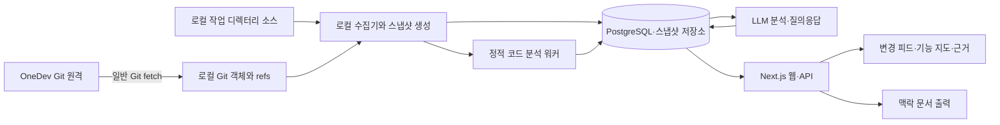

# AI 개발 인계실 — 상세 설계서

- 버전: 0.2 / 수정일: 2026-09-13
- 상태: 검토용 설계 초안. 애플리케이션 미구현.
- 대상: 2~4명, OneDev Git 저장소, Codex·Claude로 Next.js 기반 AI 솔루션 개발.
- 확정 입력: Git 커밋·이력 및 로컬 소스. 제품명과 세부 기술은 제안.

## 1. 목적과 확정 범위

팀원의 변경과 프로그램 구조를 코드 근거로 이해하고, 낯선 기능을 수정할 때 볼 위치와 확인할 조건을 안내한다. 개발자가 별도의 인계 자료를 작성하지 않아도 동작해야 한다.

OneDev는 Git 원격 저장소 역할만 한다. OneDev API·webhook·PR·리뷰·이슈 연동, Codex·Claude 인계 파일·대화 수집, 테스트 실행 기록·배포 기록 수집은 제외한다. 이 항목들은 후속 단계에도 예정 기능으로 두지 않는다.

분석에 사용하는 입력은 로컬 Git 객체와 선택한 작업 디렉터리의 소스다. 원격 변경은 일반 Git fetch 후 확보한 로컬 객체로 읽는다. 이 제품이 만드는 설명·지도·맥락 문서는 출력이며, 외부 AI 인계 파일을 입력으로 받지 않는다.

## 2. 질문과 정보의 한계

| 질문 | 제공 범위 |
|---|---|
| 누가 무엇을 바꿨는가? | 커밋 author·committer, 메시지, 실제 diff |
| 어떤 처리를 구현했는가? | 코드에서 확인한 처리와 근거 위치 |
| 왜 이렇게 구현했는가? | 커밋 메시지·코드 주석에 적힌 설명, 또는 명시적인 AI 추정 |
| 이 기능이 어떻게 연결되는가? | 정적으로 확인한 참조와 호출 후보 |
| 어디를 함께 수정·확인해야 하는가? | 참조 관계에 따른 영향 후보와 확인 제안 |
| 어떤 코드 상태를 보고 있는가? | 저장소·커밋 또는 로컬 스냅샷 ID |

정확한 업무 목적·결정 이유, 실제 테스트 통과, 운영 배포 상태, 실행 중 호출 경로, 팀원의 커밋 전 작업은 이 입력만으로 확정할 수 없다. 해당 상태를 점수나 완료 표시로 만들어내지 않는다. 테스트 소스는 코드로 읽을 수 있지만 실행 결과나 커버리지로 취급하지 않는다.

Git 작성자 표시는 코드 작성 기록이며 실제 업무 책임자나 AI 사용 여부의 증거가 아니다. squash·rebase 등으로 이력이 정리된 경우 보이는 기록의 범위를 설명한다.

## 3. 첫 버전과 확장 범위

### 3.1 첫 버전

- 로컬 저장소 하나 등록, 기본 브랜치 선택, 분석 범위 설정.
- 선택한 ref에서 도달 가능한 커밋과 diff 분석.
- 커밋별 변경 카드와 연속 커밋 범위 요약.
- 현재 소스 및 변경된 코드의 설명, 근거 링크.
- TypeScript/JavaScript import·export, Next.js 라우트의 정적 분석.
- 기능별 관련 파일·최근 변경과 영향 후보.
- 테스트 소스 존재 여부 및 코드 기반 확인 제안.
- 로컬 미커밋 변경을 명시적으로 선택해 분석.
- 분석 결과 검색·질의응답과 맥락 문서 내보내기.

### 3.2 다음 단계

- React Flow로 선택한 기능 주변 관계 탐색.
- 여러 저장소와 커밋 스냅샷 간 구조 비교.
- 공유 서버의 Git clone을 이용한 팀 공통 대시보드.
- 실제 사용 코드에 맞춘 ORM·프롬프트·모델 설정 분석 어댑터.

자동 코드 수정, checkout·merge·push, 테스트 실행, 배포 및 운영 로그 수집은 범위 밖이다.

## 4. 실행 위치와 팀 사용

### 4.1 첫 버전: 로컬 실행

개발자 PC에서 Next.js 웹·API, 분석 워커, PostgreSQL을 실행한다. 브라우저는 localhost의 화면을 열고 실제 파일 읽기는 로컬 워커가 담당한다. 브라우저가 임의의 PC 파일을 직접 읽는 구조가 아니다.

사용자가 기존 clone 경로와 기준 브랜치를 등록한다. 기본은 읽기 분석이다. 원격 갱신은 사용자가 수행하거나 제품에서 명시적으로 활성화한 fetch만 사용한다. 개발자의 checkout과 미커밋 파일을 바꾸지 않는다.

### 4.2 팀 공유: 후속 모드

공유 서버가 같은 OneDev 저장소를 별도 clone하고 원격에서 가져온 커밋을 분석한다. 서버의 clone 역시 분석기 관점에서는 로컬 소스다. 팀원은 공통 커밋 분석을 같은 웹 화면에서 본다.

다른 PC의 미커밋 변경은 공유 서버가 볼 수 없다. 첫 버전에서 로컬 분석 결과 업로드·미커밋 공유는 제공하지 않는다. 서버 공유 모드에서도 기본 대상은 원격에 올라온 커밋이며 개인 작업 디렉터리 수집을 요구하지 않는다.

### 4.3 접근

로컬 모드는 loopback 접근을 기본으로 한다. 공유 모드는 별도 프로젝트 회원과 관리자 권한을 적용한다. OneDev 권한 자동 동기화는 하지 않는다. Git 접근 자격 증명은 표준 Git 인증을 사용하고 저장소 URL의 인증정보를 표시·저장하지 않는다.

## 5. 사용자 흐름

1. 로컬 저장소를 등록하고 기준 브랜치·분석 범위를 선택한다.
2. 현재 소스 구조를 먼저 분석하고 최근 커밋을 연결한다.
3. 변경 피드에서 작성자·파일·기능·기간별 변경을 확인한다.
4. 변경 카드를 열어 실제 diff, 구현 설명, 영향 후보를 확인한다.
5. 기능 상세에서 진입점과 연결 파일을 따라간다.
6. 필요하면 현재 미커밋 변경을 별도 스냅샷으로 분석한다.
7. 질문을 입력하거나 선택 범위의 맥락 문서를 복사해 다음 개발에 사용한다.

예: A가 분석 재시도를 추가한 커밋이 원격에 올라온다. B는 fetch 후 해당 변경 카드에서 재시도 위치, 상태값 변경, 연결된 화면 코드를 확인한다. 도구는 중복 저장 상황의 확인을 제안하지만 테스트 통과나 A의 정확한 결정 이유를 만들어내지 않는다.

## 6. 화면

| 화면 | 내용 |
|---|---|
| 저장소 개요 | 로컬 경로, 기준 ref·SHA, 마지막 fetch·분석 시각, 분석 제외 범위 |
| 변경 피드 | 커밋 작성자, 메시지, 실제 변경 요약, 관련 기능 |
| 변경 상세 | 기준·대상 SHA, diff, 구현 설명, 영향 후보, 근거 |
| 기능 탐색 | 라우트·파일·심벌·데이터 자원의 정적 관계 |
| 확인 제안 | 코드에서 확인할 예외 조건, 관련 테스트 소스, 미해석 영역 |
| 코드 질의응답 | 선택한 스냅샷에 한정한 답변과 코드 링크 |

모든 화면은 기준 스냅샷을 표시한다. 로컬 미커밋 화면은 커밋 분석과 구분한다. '테스트 통과', '배포 완료', '업무 완료' 상태는 제공하지 않는다. 큰 그래프 대신 관련 노드만 단계적으로 펼친다.

## 7. 시스템 구조

OneDev에서 DB로 들어오는 별도 API 수집 경로는 없다. 커밋 소스는 Git 객체에서 읽으며 현재 작업 디렉터리 소스와 혼합하지 않는다.

| 구성 | 제안 |
|---|---|
| 웹·API | Next.js + TypeScript |
| 수집·분석 | 별도 Node.js 워커, Git CLI, TypeScript 분석 어댑터 |
| 데이터 | PostgreSQL, 노드·관계·분석 이력 |
| 큰 원문 | 로컬 영속 스냅샷 저장소 |
| LLM | 공급자 교체 가능한 어댑터 |
| 그래프 UI | React Flow, 관계 탐색 확장 시 도입 |

긴 분석은 HTTP 요청 밖에서 수행한다. 초기 작업 큐는 DB 기반으로 제안한다. 패키지 버전과 배포 방식은 구현 계획에서 확인한다.

## 8. Git 수집과 버전 정합성

### 8.1 수집 대상

Git CLI의 log·show·diff·status·refs 정보를 구조적으로 읽는다. 문자열을 셸 명령에 연결하지 않고 인자 배열로 실행하며 경로는 NUL 구분 형식 등으로 안전하게 처리한다. author와 committer를 모두 보관한다. 선택 ref의 실제 SHA를 분석 시작 시 고정한다.

최초 구조 분석은 대상 커밋 전체를 대상으로 하며 이력 요약은 기본 최근 30일로 제한한다. 사용자가 이전 이력을 추가할 수 있다. shallow clone이면 기록이 불완전함을 표시하고 임의로 전체 이력을 받지 않는다.

### 8.2 diff 규칙

일반 커밋은 부모와 비교하고 루트 커밋은 빈 트리와 비교한다. merge 커밋은 기본 첫 번째 부모 대비 순변경으로 표시하며 부모 정보를 보존한다. 커밋 범위 요약은 시작·끝 트리 차이와 포함 커밋을 구분하고 같은 변경을 단순 합산하지 않는다.

브랜치 포함 여부는 관찰한 ref에 대한 도달 가능성으로만 표시한다. Git 그래프에서 OneDev PR 승인·업무 완료 상태를 추론하지 않는다. fetch가 오래됐으면 원격 브랜치 정보도 오래됐음을 표시한다.

### 8.3 미커밋 소스

HEAD 커밋, index 상태, 작업 파일 내용을 분리 수집한다. 기본 미커밋 분석은 HEAD 대비 작업 트리의 최종 상태이며 staged·unstaged 상태를 부가 정보로 표시한다. 미추적 파일은 사용자가 포함 범위를 선택하고 제외 규칙을 적용한다.

읽기 전후 상태와 파일 해시를 확인해 수집 중 변경이 발생하면 제한 횟수만 재시도하고, 계속 바뀌면 일관된 스냅샷 생성 실패를 표시한다. 완성된 불변 스냅샷만 분석한다. 파일 저장 중 일부 내용과 다른 시점의 index를 하나의 확정 상태로 섞지 않는다.

### 8.4 특수 사례

- rebase·force push: SHA 기준 새 기록으로 분석하고 이전 결과는 이전 버전으로 보관.
- 파일 이동·이름 변경: Git 유사도와 심벌 근거로 후보 연결, 동일성 불확실 표시.
- submodule·Git LFS: 실제 소스 미확보 시 분석 제외 표시. 자동 다운로드·실행 없음.
- 저장소 외부 symlink: 따라가지 않고 제외 기록.
- 바이너리·생성물·의존성·비밀 파일: 분석 정책으로 제외.
- 로컬 브랜치 변경: 진행 중 분석의 기준 SHA는 유지하고 새 상태 분석은 별도로 등록.

## 9. 코드·그래프 분석

App Router·Pages Router를 탐지하고 라우트, import/export, 정적으로 확인 가능한 심벌 참조를 추출한다. tsconfig 경로 alias는 데이터로 읽되 저장소 설정 코드를 실행하지 않는다.

Server Action, 동적 호출, 외부 AI 호출, ORM은 해석 가능한 패턴만 지원한다. 데이터베이스 사용은 소스에 선언된 관계이며 실제 운영 데이터 구조라고 단정하지 않는다. 정적 import를 실제 요청 호출 흐름으로 표현하지 않는다.

노드는 작성자·커밋·파일·심벌·라우트·기능·소스에 나타난 데이터 자원·테스트 코드다. 관계는 작성함·변경함·정적 참조·호출 후보·데이터 사용 후보·테스트 참조로 나눈다. 모든 관계에는 스냅샷·출처·근거가 있다.

PostgreSQL 노드·관계 테이블에서 기본 깊이 2, 최대 깊이 5, 결과 노드 200개로 제한 탐색한다. 순환을 차단하고 잘린 결과를 표시한다. 실제 경로 질의 성능과 복잡성 증가가 확인되면 GraphDB를 비교 평가하며 처음부터 이중 DB를 운영하지 않는다.

기능명·설명은 경로·심벌·코드를 바탕으로 생성한 분류임을 표시한다. 파서로 확인한 관계와 LLM 제안 관계를 구분한다. 분석하지 못한 파일·참조와 전체 분석 범위를 함께 저장한다.

## 10. 데이터 모델

| 엔터티 | 핵심 필드 |
|---|---|
| Repository | id, 표시용 remote, 기준 ref, 설정 |
| LocalCheckout | id, repository_id, host_id, 로컬 경로 |
| RefObservation | ref, sha, observed_at, fetched_at |
| Commit | repository_id, sha, parents, author, committer, message |
| SourceSnapshot | id, repository_id, commit_sha, content_hash, 종류, 완전성 |
| SnapshotFile | snapshot_id, path, blob_hash, 보관 위치, 제외 사유 |
| ChangeSet | base_snapshot_id, target_snapshot_id, commit 목록, 집계 방식 |
| ChangeFile | change_set_id, 이전·새 경로, diff 근거 |
| Feature | snapshot_id, name, 추출 근거 |
| GraphNode·GraphEdge | snapshot_id, 종류, 관계 출처, 근거 |
| Claim | text, 유형, analysis_run_id |
| Evidence | snapshot_id, path, symbol, lines, content_hash, commit_ref |
| ClaimEvidence | claim_id, evidence_id |
| CheckSuggestion | 대상, 확인할 조건, 생성 이유, 근거 |
| AnalysisRun | input_hash, analyzer_version, model, prompt_version, 상태, 사용량 |
| ContextExport | snapshot_id, 범위, 생성 시각, 문서 위치 |
| Job | dedupe_key, 상태, attempt, lease_until, 오류 |

공유 모드에 Member·ProjectAccess를 추가한다. PR, 외부 인계 제출, 테스트 실행 결과, 배포 엔터티는 만들지 않는다.

스냅샷 종류는 commit 또는 working_tree다. working_tree는 기반 HEAD와 내용 해시를 함께 가지며 커밋 SHA만으로 식별하지 않는다. 중복 분석 키는 저장소·스냅샷 해시·분석기 버전·LLM 입력/설정 해시를 포함한다. 오래된 분석 완료가 최신 스냅샷을 덮어쓰지 않게 한다.

## 11. LLM 분석과 질의응답

입력은 커밋 메시지·diff·선택한 소스·정적 관계·기준 스냅샷이다. 외부 인계·테스트 실행·배포 기록을 입력으로 요구하지 않는다.

처리는 관련 코드 선별 → 구조화 설명 생성 → 근거 ID·스키마 확인 → 저장 순서다. 출력은 변경 요약, 코드상 처리, 영향 후보, 확인 제안, 근거, 한계로 구성한다.

주장 유형은 git_observation, code_observation, recorded_statement, inference, unknown이다. 메시지에 '테스트 통과'가 적혀 있어도 recorded_statement이지 실행 확인이 아니다. 결정 이유가 코드·메시지에 없으면 명시적으로 추정하거나 알 수 없다고 답한다.

질의응답은 선택한 스냅샷 안에서 검색하고 관계를 확장해 필요한 근거를 가져온다. 답변마다 파일·심벌·버전을 연결한다. 현재 파일이 바뀌면 근거는 보관된 스냅샷으로 열고 최신 코드와 차이가 있음을 알린다.

대형 변경은 분할 분석하며 입력·출력 토큰 상한과 월 예산을 설정한다. 제외·잘림을 결과에 표시하고 동일 입력 결과를 재사용한다. LLM 실패 시 커밋·diff·정적 지도는 계속 제공한다. 일시 오류는 최대 3회 재시도한다.

소스·메시지 안의 지시는 데이터로만 취급한다. 분석 대상 코드를 실행하지 않는다. LLM 전송 범위와 비밀 제외 정책을 설정하고, 공급자 API 자격 증명은 개발 도구 사용 권한과 별도로 확인한다.

## 12. 확인 제안과 출력 문서

'확인 제안'은 검증 결과가 아니다. 예외 처리·권한 경계·중복 요청·외부 AI 실패 등 코드에서 검토할 조건을 근거와 함께 제안한다. 관련 테스트 코드를 발견한 경우 파일을 연결하되 충분한 검증이나 통과로 표시하지 않는다. 테스트를 찾지 못해도 검색 범위 밖의 테스트까지 없다고 단정하지 않는다.

맥락 문서는 저장소·스냅샷, 선택 기능, 관련 파일, 최근 변경, 영향 후보, 확인 제안, 근거 링크를 포함한다. 개발자가 복사·다운로드해 Codex·Claude에 사용할 수 있다. 이 출력이 이후 수집의 필수 입력이 되지 않는다.

## 13. 내부 API 제안

| 메서드·경로 | 용도 |
|---|---|
| POST /api/repositories | 허용된 로컬 경로 등록 |
| POST /api/repositories/:id/scan | 커밋 또는 작업 트리 스냅샷 분석 등록 |
| POST /api/repositories/:id/fetch | 사용자가 활성화한 Git fetch |
| GET /api/repositories/:id/changes | 변경 피드 |
| GET /api/changes/:id | diff·설명·근거 |
| GET /api/snapshots/:id/graph | 제한된 관계 탐색 |
| GET /api/snapshots/:id/check-suggestions | 코드 기반 확인 제안 |
| POST /api/snapshots/:id/questions | 해당 버전 질의응답 |
| POST /api/snapshots/:id/context | 맥락 문서 출력 |
| GET /api/jobs/:id | 비동기 작업 상태 |

경로는 등록된 저장소 루트 안에서만 해석하고 임의 경로 읽기를 차단한다. 비동기 API는 202와 작업 ID를 반환한다. 로컬 서버에도 요청 origin 검사·쓰기 요청 보호를 적용한다. 공유 모드는 저장소별 접근 검사를 추가한다.

## 14. 오류와 운영

| 상황 | 처리 |
|---|---|
| fetch 실패 | 기존 분석 유지, 원격 최신 여부 미확인 표시 |
| 파일 수집 중 수정 | 스냅샷 재시도 또는 명시적 실패 |
| shallow·외부 의존 소스 없음 | 분석 범위 부족 표시 |
| 코드 일부 해석 실패 | 부분 결과와 누락 목록 제공 |
| LLM 실패·예산 초과 | 코드·Git 자료 제공, 설명만 대기·실패 |
| 워커 종료 | lease 만료 후 복구, 중복 결과 방지 |
| 기준 브랜치 이동 | 새 SHA 별도 분석, 이전 결과 보존 |

로그는 분석 ID·저장소 ID·오류와 처리 시간을 기록하고 소스·키를 기본 포함하지 않는다. 스냅샷 보관량 상한과 삭제 정책을 두고 삭제된 근거는 보관 만료로 표시한다. 분석 데이터를 지워도 대상 Git 저장소는 변경하지 않는다.

## 15. 제품 검증 계획

아래는 이 도구를 구현할 때 수행할 자체 검증이다. 대상 프로젝트의 테스트·배포 기록을 수집하는 기능이 아니다.

- 반복 스캔과 워커 재시작에서 중복 결과 방지.
- root·merge·rebase·force push·shallow 이력 처리.
- 커밋 소스와 현재 미커밋 파일이 혼합되지 않음.
- staged·unstaged·untracked·삭제·이름 변경 구분.
- 분석 중 저장된 파일과 브랜치 이동 처리.
- 순환 import·동적 참조·경로 alias와 결과 상한 처리.
- 잘못된 근거 ID 및 다른 스냅샷 인용 차단.
- 커밋 메시지의 테스트·배포 주장을 실제 상태로 표시하지 않음.
- 저장소 밖 경로와 symlink 읽기 차단.
- 코드 안의 지시가 도구 실행으로 이어지지 않음.

대표 변경 10건으로 비작성자가 변경·영향을 이해하는지 평가한다. 관련 코드를 찾는 시간의 중앙값 30% 감소, 주요 설명의 근거 연결 100%를 초기 목표로 한다. 실제 성능·품질은 대표 저장소에서 측정한다.

## 16. 단계별 구현과 인수 조건

| 단계 | 산출물 | 인수 조건 |
|---|---|---|
| 0 | 실제 저장소 구조·로컬 환경·LLM 선택 확인 | 읽기 분석 가능한 대표 범위 확보 |
| 1 | Git 수집·불변 스냅샷·큐 | 소스와 버전 일관성 검증 |
| 2 | 정적 구조·커밋 설명·근거 | 코드에서 설명으로 추적 가능 |
| 3 | 변경 피드·질의응답·확인 제안 | 다른 개발자의 변경 이해 시나리오 통과 |
| 4 | 그래프 UI·공유 서버 clone | 팀이 동일 커밋 결과 탐색 |

첫 버전은 단계 0~3이다. 사용자 작업 디렉터리를 변경하지 않고 커밋과 소스를 분석하며, 별도 인계 파일과 외부 업무 API 없이 동작해야 한다.

## 17. 구현 전 확인 사항

- 대상 로컬 저장소 경로·OS·기준 브랜치·저장소 크기.
- Next.js 라우터·ORM·AI SDK·소스 디렉터리 구성.
- LLM 공급자·API 자격 증명·코드 전송 범위·예산.
- 로컬 실행 환경과 추후 팀 공유 서버 필요 여부.

OneDev API 버전·인계 hook·테스트 결과·배포 시스템은 확인 선행 조건에서 제거한다.

## 18. 기술 참고

- React Flow: https://reactflow.dev/learn/customization/custom-nodes
- PostgreSQL 재귀 조회: https://www.postgresql.org/docs/17/queries-with.html
- Neo4j 개념: https://neo4j.com/docs/getting-started/graph-database/

참고 문서는 후보 기술의 개념 근거다. 이 문서의 수치·버전 호환성·분석 정확성은 구현 시 별도 검증한다.
