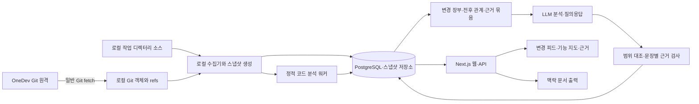

# AI 개발 인계실 — 상세 설계서

- 버전: 0.3 / 수정일: 2026-09-13
- 상태: 검토용 설계 초안. 애플리케이션 미구현.
- 대상: 2~4명, OneDev Git 저장소, Codex·Claude로 Next.js 기반 AI 솔루션 개발.
- 확정 입력: Git 커밋·이력 및 로컬 소스. 제품명과 세부 기술은 제안.

v0.3은 관계 누락 탐지·변경 의도·근거 검증을 강화한다. [리서치 근거](research-evidence.md)와 19~25장의 구현 계약을 함께 적용한다. 새 장의 수치는 연구가 보장한 성능이 아니라 이 제품의 검증 목표다.

## 1. 목적과 확정 범위

팀원의 변경과 프로그램 구조를 코드 근거로 이해하고, 낯선 기능을 수정할 때 볼 위치와 확인할 조건을 안내한다. 개발자가 별도의 인계 자료를 작성하지 않아도 동작해야 한다.

OneDev는 Git 원격 저장소이며 선택적으로 읽기 전용 PR 조회 API를 제공한다. PR·리뷰·댓글·업데이트는 OneDev 기록으로만 표시하고 코드 사실이나 테스트 통과로 추정하지 않는다. Codex·Claude 인계 파일·대화 수집, 테스트 실행 기록·배포 기록 수집은 제외한다.

분석에 사용하는 입력은 로컬 Git 객체와 선택한 작업 디렉터리의 소스다. 원격 변경은 일반 Git fetch 후 확보한 로컬 객체로 읽는다. 이 제품이 만드는 설명·지도·맥락 문서는 출력이며, 외부 AI 인계 파일을 입력으로 받지 않는다.

## 2. 질문과 정보의 한계

| 질문 | 제공 범위 |
|---|---|
| 누가 무엇을 바꿨는가? | 커밋 author·committer, 메시지, 실제 diff |
| 어떤 처리를 구현했는가? | 코드에서 확인한 처리와 근거 위치 |
| 왜 이렇게 구현했는가? | 커밋 메시지·코드 주석에 적힌 설명, 또는 명시적인 AI 추정 |
| 이 기능이 어떻게 연결되는가? | 정적으로 확인한 참조와 호출 후보 |
| 어디를 함께 수정·확인해야 하는가? | 참조 관계에 따른 영향 후보와 확인 제안 |
| 어떤 코드 상태를 보고 있는가? | 저장소·커밋 또는 로컬 스냅샷 ID |

정확한 업무 목적·결정 이유, 실제 테스트 통과, 운영 배포 상태, 실행 중 호출 경로, 팀원의 커밋 전 작업은 이 입력만으로 확정할 수 없다. 해당 상태를 점수나 완료 표시로 만들어내지 않는다. 테스트 소스는 코드로 읽을 수 있지만 실행 결과나 커버리지로 취급하지 않는다.

Git 작성자 표시는 코드 작성 기록이며 실제 업무 책임자나 AI 사용 여부의 증거가 아니다. squash·rebase 등으로 이력이 정리된 경우 보이는 기록의 범위를 설명한다.

## 3. 첫 버전과 확장 범위

### 3.1 첫 버전

- 로컬 저장소 하나 등록, 기본 브랜치 선택, 분석 범위 설정.
- 모든 ref에서 도달 가능한 커밋과 diff 분석.
- OneDev PR 목록·상세·변경·리뷰·댓글·업데이트 조회와 PR Git ref 존재 확인.
- 커밋별 변경 카드와 연속 커밋 범위 요약.
- 현재 소스 및 변경된 코드의 설명, 근거 링크.
- TypeScript/JavaScript import·export, Next.js 라우트의 정적 분석.
- 기능별 관련 파일·최근 변경과 영향 후보.
- 테스트 소스 존재 여부 및 코드 기반 확인 제안.
- 로컬 미커밋 변경을 명시적으로 선택해 분석.
- 분석 결과 검색·질의응답과 맥락 문서 내보내기.

### 3.2 다음 단계

- React Flow로 선택한 기능 주변 관계 탐색.
- 여러 저장소와 커밋 스냅샷 간 구조 비교.
- 공유 서버의 Git clone을 이용한 팀 공통 대시보드.
- 실제 사용 코드에 맞춘 ORM·프롬프트·모델 설정 분석 어댑터.

자동 코드 수정, checkout·merge·push, 테스트 실행, 배포 및 운영 로그 수집은 범위 밖이다.

## 4. 실행 위치와 팀 사용

### 4.1 첫 버전: 로컬 실행

개발자 PC에서 Next.js 웹·API, 분석 워커, PostgreSQL을 실행한다. 브라우저는 localhost의 화면을 열고 실제 파일 읽기는 로컬 워커가 담당한다. 브라우저가 임의의 PC 파일을 직접 읽는 구조가 아니다.

사용자가 기존 clone 경로와 기준 브랜치를 등록한다. 기본은 읽기 분석이다. 원격 갱신은 사용자가 수행하거나 제품에서 명시적으로 활성화한 fetch만 사용한다. 개발자의 checkout과 미커밋 파일을 바꾸지 않는다.

### 4.2 팀 공유: 후속 모드

공유 서버가 같은 OneDev 저장소를 별도 clone하고 원격에서 가져온 커밋을 분석한다. 서버의 clone 역시 분석기 관점에서는 로컬 소스다. 팀원은 공통 커밋 분석을 같은 웹 화면에서 본다.

다른 PC의 미커밋 변경은 공유 서버가 볼 수 없다. 첫 버전에서 로컬 분석 결과 업로드·미커밋 공유는 제공하지 않는다. 서버 공유 모드에서도 기본 대상은 원격에 올라온 커밋이며 개인 작업 디렉터리 수집을 요구하지 않는다.

### 4.3 접근

로컬 모드는 loopback 접근을 기본으로 한다. 공유 모드는 별도 프로젝트 회원과 관리자 권한을 적용한다. OneDev 권한 자동 동기화는 하지 않는다. Git 접근 자격 증명은 표준 Git 인증을 사용하고 저장소 URL의 인증정보를 표시·저장하지 않는다.

## 5. 사용자 흐름

1. 로컬 저장소를 등록하고 기준 브랜치·분석 범위를 선택한다.
2. 현재 소스 구조를 먼저 분석하고 최근 커밋을 연결한다.
3. 변경 피드에서 작성자·파일·기능·기간별 변경을 확인한다.
4. 변경 카드를 열어 실제 diff, 구현 설명, 영향 후보를 확인한다.
5. 기능 상세에서 진입점과 연결 파일을 따라간다.
6. 필요하면 현재 미커밋 변경을 별도 스냅샷으로 분석한다.
7. 질문을 입력하거나 선택 범위의 맥락 문서를 복사해 다음 개발에 사용한다.

예: A가 분석 재시도를 추가한 커밋이 원격에 올라온다. B는 fetch 후 해당 변경 카드에서 재시도 위치, 상태값 변경, 연결된 화면 코드를 확인한다. 도구는 중복 저장 상황의 확인을 제안하지만 테스트 통과나 A의 정확한 결정 이유를 만들어내지 않는다.

## 6. 화면

| 화면 | 내용 |
|---|---|
| 저장소 개요 | 로컬 경로, 기준 ref·SHA, 마지막 fetch·분석 시각, 분석 제외 범위 |
| 변경 피드 | 커밋 작성자, 메시지, 실제 변경 요약, 관련 기능 |
| 변경 상세 | 기준·대상 SHA, diff, 구현 설명, 영향 후보, 근거 |
| 기능 탐색 | 라우트·파일·심벌·데이터 자원의 정적 관계 |
| 확인 제안 | 코드에서 확인할 예외 조건, 관련 테스트 소스, 미해석 영역 |
| 코드 질의응답 | 선택한 스냅샷에 한정한 답변과 코드 링크 |

모든 화면은 기준 스냅샷을 표시한다. 로컬 미커밋 화면은 커밋 분석과 구분한다. '테스트 통과', '배포 완료', '업무 완료' 상태는 제공하지 않는다. 큰 그래프 대신 관련 노드만 단계적으로 펼친다.

## 7. 시스템 구조

OneDev PR 메타데이터는 서버 API 어댑터를 통해 읽고, 커밋·소스는 로컬 Git 객체에서 읽는다. PR의 `refs/pulls/<number>/{base,head,merge}`가 로컬에 있을 때만 소스 분석 대상과 연결한다. 현재 작업 디렉터리 소스와 PR 메타데이터를 혼합하지 않는다.

| 구성 | 제안 |
|---|---|
| 웹·API | Next.js + TypeScript |
| 수집·분석 | 별도 Node.js 워커, Git CLI, TypeScript 분석 어댑터 |
| 데이터 | PostgreSQL, 노드·관계·분석 이력 |
| 큰 원문 | 로컬 영속 스냅샷 저장소 |
| LLM | 공급자 교체 가능한 어댑터 |
| 그래프 UI | React Flow, 관계 탐색 확장 시 도입 |

긴 분석은 HTTP 요청 밖에서 수행한다. 초기 작업 큐는 DB 기반으로 제안한다. 패키지 버전과 배포 방식은 구현 계획에서 확인한다.

## 8. Git 수집과 버전 정합성

### 8.1 수집 대상

Git CLI의 log·show·diff·status·refs 정보를 구조적으로 읽는다. 문자열을 셸 명령에 연결하지 않고 인자 배열로 실행하며 경로는 NUL 구분 형식 등으로 안전하게 처리한다. author와 committer를 모두 보관한다. 선택 ref의 실제 SHA를 분석 시작 시 고정한다.

최초 구조 분석은 대상 커밋 전체를 대상으로 하며 이력 요약은 기본 최근 30일로 제한한다. 사용자가 이전 이력을 추가할 수 있다. shallow clone이면 기록이 불완전함을 표시하고 임의로 전체 이력을 받지 않는다.

### 8.2 diff 규칙

일반 커밋은 부모와 비교하고 루트 커밋은 빈 트리와 비교한다. merge 커밋은 기본 첫 번째 부모 대비 순변경으로 표시하며 부모 정보를 보존한다. 커밋 범위 요약은 시작·끝 트리 차이와 포함 커밋을 구분하고 같은 변경을 단순 합산하지 않는다.

브랜치 포함 여부는 관찰한 ref에 대한 도달 가능성으로만 표시한다. Git 그래프에서 OneDev PR 승인·업무 완료 상태를 추론하지 않는다. fetch가 오래됐으면 원격 브랜치 정보도 오래됐음을 표시한다.

### 8.3 미커밋 소스

HEAD 커밋, index 상태, 작업 파일 내용을 분리 수집한다. 기본 미커밋 분석은 HEAD 대비 작업 트리의 최종 상태이며 staged·unstaged 상태를 부가 정보로 표시한다. 미추적 파일은 사용자가 포함 범위를 선택하고 제외 규칙을 적용한다.

읽기 전후 상태와 파일 해시를 확인해 수집 중 변경이 발생하면 제한 횟수만 재시도하고, 계속 바뀌면 일관된 스냅샷 생성 실패를 표시한다. 완성된 불변 스냅샷만 분석한다. 파일 저장 중 일부 내용과 다른 시점의 index를 하나의 확정 상태로 섞지 않는다.

### 8.4 특수 사례

- rebase·force push: SHA 기준 새 기록으로 분석하고 이전 결과는 이전 버전으로 보관.
- 파일 이동·이름 변경: Git 유사도와 심벌 근거로 후보 연결, 동일성 불확실 표시.
- submodule·Git LFS: 실제 소스 미확보 시 분석 제외 표시. 자동 다운로드·실행 없음.
- 저장소 외부 symlink: 따라가지 않고 제외 기록.
- 바이너리·생성물·의존성·비밀 파일: 분석 정책으로 제외.
- 로컬 브랜치 변경: 진행 중 분석의 기준 SHA는 유지하고 새 상태 분석은 별도로 등록.

## 9. 코드·그래프 분석

App Router·Pages Router를 탐지하고 라우트, import/export, 정적으로 확인 가능한 심벌 참조를 추출한다. tsconfig 경로 alias는 데이터로 읽되 저장소 설정 코드를 실행하지 않는다.

Server Action, 동적 호출, 외부 AI 호출, ORM은 해석 가능한 패턴만 지원한다. 데이터베이스 사용은 소스에 선언된 관계이며 실제 운영 데이터 구조라고 단정하지 않는다. 정적 import를 실제 요청 호출 흐름으로 표현하지 않는다.

노드는 작성자·커밋·파일·심벌·라우트·기능·소스에 나타난 데이터 자원·테스트 코드다. 관계는 작성함·변경함·정적 참조·호출 후보·데이터 사용 후보·테스트 참조로 나눈다. 모든 관계에는 스냅샷·출처·근거가 있다.

화면 조회는 PostgreSQL 노드·관계 테이블에서 기본 깊이 2, 최대 깊이 5, 결과 노드 200개로 제한한다. 분석 엔진은 화면 제한을 사용하지 않고 21장의 별도 작업 예산과 미탐색 장부를 적용한다. 순환을 차단하고 잘린 결과를 표시한다. 실제 경로 질의 성능과 복잡성 증가가 확인되면 GraphDB를 비교 평가하며 처음부터 이중 DB를 운영하지 않는다.

기능명·설명은 경로·심벌·코드를 바탕으로 생성한 분류임을 표시한다. 파서로 확인한 관계와 LLM 제안 관계를 구분한다. 분석하지 못한 파일·참조와 전체 분석 범위를 함께 저장한다.

## 10. 데이터 모델

| 엔터티 | 핵심 필드 |
|---|---|
| Repository | id, 표시용 remote, 기준 ref, 설정 |
| LocalCheckout | id, repository_id, host_id, 로컬 경로 |
| RefObservation | ref, sha, observed_at, fetched_at |
| Commit | repository_id, sha, parents, author, committer, message |
| SourceSnapshot | id, repository_id, commit_sha, content_hash, 종류, 완전성 |
| SnapshotFile | snapshot_id, path, blob_hash, 보관 위치, 제외 사유 |
| ChangeSet | base_snapshot_id, target_snapshot_id, commit 목록, 집계 방식 |
| ChangeFile | change_set_id, 이전·새 경로, diff 근거 |
| Feature | snapshot_id, name, 추출 근거 |
| GraphNode·GraphEdge | snapshot_id, 종류, 관계 출처, 근거 |
| Claim | text, 유형, analysis_run_id |
| Evidence | snapshot_id, path, symbol, lines, content_hash, commit_ref |
| ClaimEvidence | claim_id, evidence_id |
| CheckSuggestion | 대상, 확인할 조건, 생성 이유, 근거 |
| AnalysisRun | input_hash, analyzer_version, model, prompt_version, 상태, 사용량 |
| ContextExport | snapshot_id, 범위, 생성 시각, 문서 위치 |
| Job | dedupe_key, 상태, attempt, lease_until, 오류 |

공유 모드에 Member·ProjectAccess를 추가한다. PR 엔터티는 OneDev 읽기 결과의 캐시가 필요할 때만 추가하며, 외부 인계 제출·테스트 실행 결과·배포 엔터티는 만들지 않는다.

스냅샷 종류는 commit 또는 working_tree다. working_tree는 기반 HEAD와 내용 해시를 함께 가지며 커밋 SHA만으로 식별하지 않는다. 중복 분석 키는 저장소·스냅샷 해시·분석기 버전·LLM 입력/설정 해시를 포함한다. 오래된 분석 완료가 최신 스냅샷을 덮어쓰지 않게 한다.

## 11. LLM 분석과 질의응답

입력은 커밋 메시지·diff·선택한 소스·정적 관계·기준 스냅샷이다. 외부 인계·테스트 실행·배포 기록을 입력으로 요구하지 않는다.

처리는 변경 장부 생성 → 전후 관계 분석 → 근거 묶음 작성 → 원자적 주장 생성 → 구조·의미·범위 대조 → 상태별 저장 순서다. 출력은 변경 요약, 코드상 처리, 영향 후보, 확인 제안, 근거, 한계로 구성한다. 22장의 게이트에서 부적합한 주장은 사실 설명으로 게시하지 않는다.

주장 유형은 git_observation, code_observation, recorded_statement, inference, unknown이다. 메시지에 '테스트 통과'가 적혀 있어도 recorded_statement이지 실행 확인이 아니다. 결정 이유가 코드·메시지에 없으면 명시적으로 추정하거나 알 수 없다고 답한다.

질의응답은 선택한 스냅샷 안에서 검색하고 관계를 확장해 필요한 근거를 가져온다. 답변마다 파일·심벌·버전을 연결한다. 현재 파일이 바뀌면 근거는 보관된 스냅샷으로 열고 최신 코드와 차이가 있음을 알린다.

대형 변경은 분할 분석하며 입력·출력 토큰 상한과 월 예산을 설정한다. 제외·잘림을 결과에 표시하고 동일 입력 결과를 재사용한다. LLM 실패 시 커밋·diff·정적 지도는 계속 제공한다. 일시 오류는 최대 3회 재시도한다.

소스·메시지 안의 지시는 데이터로만 취급한다. 분석 대상 코드를 실행하지 않는다. LLM 전송 범위와 비밀 제외 정책을 설정하고, 공급자 API 자격 증명은 개발 도구 사용 권한과 별도로 확인한다.

## 12. 확인 제안과 출력 문서

'확인 제안'은 검증 결과가 아니다. 예외 처리·권한 경계·중복 요청·외부 AI 실패 등 코드에서 검토할 조건을 근거와 함께 제안한다. 관련 테스트 코드를 발견한 경우 파일을 연결하되 충분한 검증이나 통과로 표시하지 않는다. 테스트를 찾지 못해도 검색 범위 밖의 테스트까지 없다고 단정하지 않는다.

맥락 문서는 저장소·스냅샷, 선택 기능, 관련 파일, 최근 변경, 영향 후보, 확인 제안, 근거 링크를 포함한다. 개발자가 복사·다운로드해 Codex·Claude에 사용할 수 있다. 이 출력이 이후 수집의 필수 입력이 되지 않는다.

## 13. 내부 API 제안

| 메서드·경로 | 용도 |
|---|---|
| POST /api/repositories | 허용된 로컬 경로 등록 |
| POST /api/repositories/:id/scan | 커밋 또는 작업 트리 스냅샷 분석 등록 |
| POST /api/repositories/:id/fetch | 사용자가 활성화한 Git fetch |
| GET /api/repositories/:id/changes | 변경 피드 |
| GET /api/changes/:id | diff·설명·근거 |
| GET /api/snapshots/:id/graph | 제한된 관계 탐색 |
| GET /api/snapshots/:id/coverage | 파일·참조 분석 상태와 미해석 영역 |
| GET /api/changes/:id/ledger | 변경 단위별 설명 연결과 미설명 사유 |
| GET /api/claims/:id/evidence | 문장별 근거·반례·검사 상태 |
| GET /api/snapshots/:id/check-suggestions | 코드 기반 확인 제안 |
| POST /api/snapshots/:id/questions | 해당 버전 질의응답 |
| POST /api/snapshots/:id/context | 맥락 문서 출력 |
| GET /api/jobs/:id | 비동기 작업 상태 |

경로는 등록된 저장소 루트 안에서만 해석하고 임의 경로 읽기를 차단한다. 비동기 API는 202와 작업 ID를 반환한다. 로컬 서버에도 요청 origin 검사·쓰기 요청 보호를 적용한다. 공유 모드는 저장소별 접근 검사를 추가한다.

## 14. 오류와 운영

| 상황 | 처리 |
|---|---|
| fetch 실패 | 기존 분석 유지, 원격 최신 여부 미확인 표시 |
| 파일 수집 중 수정 | 스냅샷 재시도 또는 명시적 실패 |
| shallow·외부 의존 소스 없음 | 분석 범위 부족 표시 |
| 코드 일부 해석 실패 | 부분 결과와 누락 목록 제공 |
| LLM 실패·예산 초과 | 코드·Git 자료 제공, 설명만 대기·실패 |
| 워커 종료 | lease 만료 후 복구, 중복 결과 방지 |
| 기준 브랜치 이동 | 새 SHA 별도 분석, 이전 결과 보존 |

로그는 분석 ID·저장소 ID·오류와 처리 시간을 기록하고 소스·키를 기본 포함하지 않는다. 스냅샷 보관량 상한과 삭제 정책을 두고 삭제된 근거는 보관 만료로 표시한다. 분석 데이터를 지워도 대상 Git 저장소는 변경하지 않는다.

## 15. 제품 검증 계획

아래는 이 도구를 구현할 때 수행할 자체 검증이다. 대상 프로젝트의 테스트·배포 기록을 수집하는 기능이 아니다.

- 반복 스캔과 워커 재시작에서 중복 결과 방지.
- root·merge·rebase·force push·shallow 이력 처리.
- 커밋 소스와 현재 미커밋 파일이 혼합되지 않음.
- staged·unstaged·untracked·삭제·이름 변경 구분.
- 분석 중 저장된 파일과 브랜치 이동 처리.
- 순환 import·동적 참조·경로 alias와 결과 상한 처리.
- 잘못된 근거 ID 및 다른 스냅샷 인용 차단.
- 커밋 메시지의 테스트·배포 주장을 실제 상태로 표시하지 않음.
- 저장소 밖 경로와 symlink 읽기 차단.
- 코드 안의 지시가 도구 실행으로 이어지지 않음.

대표 변경 10건으로 비작성자가 변경·영향을 이해하는지 평가한다. 관련 코드를 찾는 시간의 중앙값 30% 감소, 주요 설명의 근거 연결 100%를 초기 목표로 한다. 실제 성능·품질은 대표 저장소에서 측정한다.

## 16. 단계별 구현과 인수 조건

| 단계 | 산출물 | 인수 조건 |
|---|---|---|
| 0 | 실제 저장소 구조·로컬 환경·LLM 선택 확인 | 읽기 분석 가능한 대표 범위 확보 |
| 1 | Git 수집·불변 스냅샷·변경 장부·큐 | 소스와 버전 일관성, 변경 항목 전수 상태 기록 |
| 2 | 타입·Next.js 분석·전후 관계·주장 검사 | 25장 고정 표본과 게시 게이트 충족 |
| 3 | 변경 피드·질의응답·분석 범위 표시 | 다른 개발자의 변경 이해 및 근거 탐색 통과 |
| 4 | 그래프 UI·공유 서버 clone | 팀이 동일 커밋 결과 탐색 |

첫 버전은 단계 0~3이다. 사용자 작업 디렉터리를 변경하지 않고 커밋과 소스를 분석하며, 별도 인계 파일과 외부 업무 API 없이 동작해야 한다.

## 17. 구현 전 확인 사항

- 대상 로컬 저장소 경로·OS·기준 브랜치·저장소 크기.
- Next.js 라우터·ORM·AI SDK·소스 디렉터리 구성.
- LLM 공급자·API 자격 증명·코드 전송 범위·예산.
- 로컬 실행 환경과 추후 팀 공유 서버 필요 여부.

OneDev API 버전·인계 hook·테스트 결과·배포 시스템은 확인 선행 조건에서 제거한다.

## 18. 기술 참고

- React Flow: https://reactflow.dev/learn/customization/custom-nodes
- PostgreSQL 재귀 조회: https://www.postgresql.org/docs/17/queries-with.html
- Neo4j 개념: https://neo4j.com/docs/getting-started/graph-database/

참고 문서는 후보 기술의 개념 근거다. 이 문서의 수치·버전 호환성·분석 정확성은 구현 시 별도 검증한다.

## 19. 분석 범위와 누락 장부

### 19.1 보장할 것과 보장하지 않을 것

'모든 실제 관계를 발견했다'는 보장을 하지 않는다. 대신 분석 대상의 모든 파일과 Git 변경 단위에 처리 상태를 남기고, 해석한 관계·미해석 후보·제외·예산 초과를 누락 없이 계수한다. 계수의 완전성은 의미 분석의 완전성과 다르다.

Git의 전체 변경 목록을 LLM 호출 전에 수집한다. 필터링된 파일만으로 분모를 만들지 않는다. binary·삭제·이름 변경·모드 변경·submodule 포인터도 항목으로 남긴다. 순수 포맷 변경 판정 역시 근거와 알고리즘 버전이 있어야 하며 LLM이 중요하지 않다고 판단했다고 삭제하지 않는다.

### 19.2 상태 계약

- 파일: indexed / partial / failed / excluded.
- 참조 후보: resolved / ambiguous / unresolved / external_boundary.
- 변경 단위: explained / explicitly_unexplained / excluded_with_reason.
- 설명 게이트: passed / partial / blocked.

각 파일에는 사유 코드, 분석기 버전, 발견한 참조 수, 파싱·타입 진단을 기록한다. discovered는 지원하는 구문 분석기가 찾은 후보 집합이며 미지원 문법 내부까지 센 값이 아니다. failed 파일은 후보 수 unknown으로 표시하고 0으로 저장하지 않는다.

불변식:

1. 전체 파일 수 = indexed + partial + failed + excluded.
2. 발견한 참조 후보 수 = resolved + ambiguous + unresolved + external_boundary.
3. 전체 변경 단위 수 = explained + explicitly_unexplained + excluded_with_reason.
4. explained 항목마다 게시 가능한 주장 또는 근거 있는 구조 변경 설명이 연결되어야 한다.

계수 불일치는 blocked다. 분석 실패나 미설명 항목이 있으면 partial로 공개하며 사유를 표시한다. 전체 재시도를 무한 반복하지 않는다.

### 19.3 변경 단위 생성

Git hunk를 전후 AST의 가장 가까운 의미 단위에 연결한다. 함수 밖 import·타입·상수·주석·설정도 독립 단위로 남긴다. 삭제 hunk는 이전 AST로, 추가 hunk는 새 AST로 연결한다. AST에 연결하지 못한 hunk는 raw_diff 단위로 보존한다. 모든 hunk는 최소 하나의 단위에 연결돼야 한다.

상위 요약에서 여러 단위를 묶을 수 있지만 상세 장부에서 개별 단위의 상태는 유지한다. 상위 요약의 한 문장을 전체 변경에 기계적으로 연결하는 것은 explained로 인정하지 않는다.

화면 예: '변경 24개: 설명 19개, 미설명 3개, 생성물 제외 2개'. 이 값은 변경 관리 상태이며 안전도 점수가 아니다.

## 20. 관계 추출과 버전별 지원 계약

### 20.1 분석 계층

| 계층 | 처리 | 실패 시 |
|---|---|---|
| L0 목록 | Git 트리·diff·파일 목록 | 해당 스냅샷 생성 실패 |
| L1 구문 | AST·import·문자열 리터럴·선언 | 파일 partial/failed |
| L2 의미 | 타입 검사기 심벌·alias·선언 연결 | L1 후보로 낮추고 진단 표시 |
| L3 규약 | Next.js 파일·서버 경계 규칙 | 미지원 규약 기록 |
| L4 설명 | LLM의 기능 이름·영향·의도 후보 | 정적 자료 제공, 설명 미확인 |

단계별 결과를 보존한다. LLM은 resolved 관계를 새로 만들어 넣지 않는다. 후보 관계를 제안할 수 있으나 승격에는 정적 근거나 규칙에 맞는 증거가 필요하다. [타입 분석 근거](https://github.com/microsoft/TypeScript/wiki/Using-the-Compiler-API)

CompilerHost는 스냅샷의 파일만 읽는다. 대상 커밋과 무관한 현재 node_modules를 그대로 사용해 과거 심벌을 확정하지 않는다. 로컬에 이미 있는 의존 타입을 사용할 때는 lockfile 대응과 파일 해시를 기록한다. 버전 일치가 확인되지 않으면 dependency_unavailable로 낮추고 외부 경계로 남긴다. 분석을 위해 패키지 설치·스크립트·플러그인을 실행하지 않는다.

지원하는 TypeScript 분석기 버전을 제품에서 고정한다. 대상 package·lockfile·tsconfig와 분석기 버전·호환 판단을 AnalysisRun에 기록한다. 미지원 버전을 발견하면 구문 수준 결과 또는 명시적 실패를 반환한다.

### 20.2 Next.js 지원 표

다음은 구현 계약이며 이미 지원되는 기능 목록이 아니다. 실제 대상 버전에 맞춘 fixture를 통과한 규칙만 활성화한다. [Next.js 규약](https://nextjs.org/docs/app/api-reference/file-conventions)

| 패턴 | 처리 목표 | 확정하지 않는 부분 |
|---|---|---|
| page·layout·route, src/app | 경로 규약과 layout 적용 관계 | 실제 요청 성공 |
| route group·동적 segment | URL 패턴과 파일 위치를 분리 | 동적 파라미터 실제 값 |
| 병렬·가로채기 경로 | slot·규약 관계로 별도 표시 | 모든 런타임 탐색 상태 |
| Pages Router | pages·API 파일 규약 분석 | 동적 데이터와 실제 실행 |
| use client·use server | 선언 위치와 서버 함수 경계 | 권한 검사·안전성 보장 |
| form action·직접 서버 함수 참조 | 심벌 해석 가능한 연결 | 조건별 실제 호출 |
| Link·router·fetch 리터럴 경로 | 경로 일치 후보 연결 | 호출 성공·인증·환경별 주소 |
| rewrites·redirects·middleware/proxy | 버전별 파일과 정적 조건 추출 | 설정 코드 실행이 필요한 결과 |
| 동적 URL·DI·콜백·문자열 dispatch | 복수 후보 또는 unresolved | 단일 실행 대상 확정 |

프레임워크 연결은 imports, references, declares_route, layout_applies, server_function_reference, route_candidate 등으로 분리한다. HTTP 후보는 메서드·정적 URL·조건을 함께 보관한다. [Server Function 선언](https://nextjs.org/docs/app/api-reference/directives/use-server)

rewrite 규칙에 따라 단순 URL-파일 매칭이 달라질 수 있다. 설정 분석이 불완전하면 관련 route_candidate에 경고를 전파한다. next.config를 import해 실행하지 않는다. [rewrite 순서와 조건](https://nextjs.org/docs/app/api-reference/config/next-config-js/rewrites)

## 21. 변경 전후 분석과 영향 범위

### 21.1 전후 자료

base와 target 각각의 소스·그래프를 확보한다. 전체 변경에 대해 추가·삭제·수정 심벌과 관계 차이를 산출한다. 삭제된 심벌의 과거 호출자와 새 심벌의 현재 호출자를 모두 조회한다. rename 후보는 유사도·심벌·본문 해시 등 판정 근거를 함께 보관하고 기능 동일성으로 단정하지 않는다. [Git rename 규칙](https://git-scm.com/docs/git-diff)

공개 export·시그니처·공유 타입·alias 설정·package 설정 변경 시 직접 변경 파일 밖으로 재분석을 전파한다. 특정 변경 단위가 기존 그래프에서 발견되지 않아도 diff 장부에서 사라지지 않는다.

### 21.2 영향 후보 생성

변경 심벌을 시작점으로 참조 역방향 탐색을 수행한다. 사용자에게 보여주는 각 영향 후보에 전후 버전, 관계 종류, 연결 경로, 약한 연결, 탐색 중단 사유를 제공한다. '영향을 받는다'는 표현 대신 근거 수준에 맞게 '직접 참조한다', '확인할 후보'를 사용한다.

화면의 200개 제한과 분석 예산은 별도다. 엔진의 초기 예산 제안은 작업당 고유 노드 10,000개·관계 50,000개·탐색 30초이며 실제 성능으로 조정한다. 직접 참조 목록도 상한에 걸릴 수 있으므로 처리하지 못한 frontier를 영속 보관한다. exhausted·unresolved·external_boundary는 다른 중단 사유다. 분석이 잘렸을 때 '추가 영향 없음'이라고 출력하지 않는다.

### 21.3 증분 재분석

Claim·근거·변경 단위·그래프 관계의 의존 연결을 저장한다. 파일·설정·규칙 버전 변경 시 영향을 받는 결과를 stale로 표시하고 재분석한다. lockfile·tsconfig·라우트 구조 변경은 좁은 diff 캐시만 재사용하지 않는다. 충분히 좁힐 수 없으면 해당 프로젝트 전체의 의미·규약 분석을 다시 실행한다.

기존 분석기의 캐시와 새 분석기의 결과를 동일 스냅샷 결과로 섞지 않는다. 파일 해시가 같아도 해석 설정이나 의존 타입이 달라지면 의미 결과를 재사용하지 않는다.

## 22. 의도·주장·근거 계약

### 22.1 의도의 세 구분

| 구분 | 표시 예 | 필수 근거 |
|---|---|---|
| 기록된 설명 | '커밋 메시지는 중복 방지를 목적으로 적고 있음' | 메시지 원문과 SHA |
| 코드상 변화 | '저장 전 존재 여부 조회를 추가함' | 전후 코드 |
| 추정한 이유 | '중복 저장을 줄이려는 변경으로 추정' | 관련 코드·메시지, 추정 표시 |

메시지가 '중복 완전 방지'라고 해도 경쟁 상태까지 해결됐다는 사실로 옮기지 않는다. 코드에서 조건이 충족되지 않거나 판단이 어려우면 메시지와 구현의 불일치 후보를 표시한다. 코드 주석도 작성된 주장이지 실행 증거는 아니다.

관련 과거 이력은 경로·심벌과 Git -S/-G 검색을 통해 제한적으로 추가 탐색한다. 탐색 범위와 shallow 경계를 기록한다. 과거 메시지는 당시 설명이며 현재 변경의 의도라고 자동 귀속하지 않는다. [Git 이력 검색](https://git-scm.com/docs/git-log)

### 22.2 원자적 주장

복합 문장을 분리한다. '중복을 막고 실패 시 복구한다'는 중복 처리와 실패 처리 두 주장으로 나눈다. 각 Claim은 scope_snapshot_ids, change_unit_ids, claim_type, text, evidence_ids, counterevidence_ids, support_status, validator_version을 가진다.

Evidence는 저장소, 스냅샷, blob hash, 경로, 심벌, 시작·끝 위치, 위치 인코딩, 발췌 해시를 포함한다. 변경 설명에는 before/after 역할을 붙인다. 코드 주장이 아닌 Git 메타데이터 주장은 커밋 필드와 원문 범위를 근거로 한다.

내부 소스 위치는 0 기반·끝 제외로 통일하고 UI에 1 기반으로 변환한다. UTF-16 등 인코딩을 명시하며 한글·이모지·CRLF 표본으로 검증한다. SCIP의 심벌·occurrence 모델을 참고하되 초기 외부 인덱스 업로드를 요구하지 않는다. [SCIP 스키마](https://github.com/scip-code/scip/blob/main/scip.proto)

### 22.3 게시 전 검사

1. 구조 검사: 필드·ID·근거 존재·스냅샷·원문 해시·범위 검사. 실패 주장은 게시 차단.
2. 결정적 검사: import·선언·리터럴·시그니처 등 지원하는 사실은 파서 결과와 대조.
3. 의미 검사: 주장과 근거 묶음·주변 분기·반례 후보를 별도 호출로 평가.
4. 범위 검사: 변경 장부의 각 단위와 설명 연결을 대조. 미설명 항목을 별도 표시.
5. 최종 분류: supported / partial / unsupported / contradicted / not_checked.

supported도 검증 방법을 표시한다. '파서 대조'와 'LLM 근거 검토'는 구분하며 후자를 프로그램의 형식적 증명으로 표현하지 않는다. partial은 문장을 근거 범위로 축소하고, unsupported는 추정·미확인으로 내리거나 삭제하며, contradicted는 사실 설명에서 제외하고 불일치로 노출한다. 검토 모델 실패 시 not_checked로 남기고 정상 통과로 취급하지 않는다.

인용이 있다는 사실과 인용이 주장을 지지한다는 사실을 나눠 평가하는 방식은 ALCE를 참고했다. 자연어 문서 평가 결과가 코드에 그대로 적용된다고 가정하지 않는다. [ALCE §3.3](https://aclanthology.org/2023.emnlp-main.398.pdf)

### 22.4 반례와 부재 주장

'항상', '모든', '없다', '안전하다', '완전히 방지한다'처럼 넓은 표현을 별도 검사한다. 권한 검사 부재·재시도 미구현을 주장하려면 검색한 진입점·래퍼·공통 처리와 미해석 경계를 제시해야 한다. 범위가 닫히지 않으면 '분석한 경로에서는 확인하지 못함'으로 표현한다.

예: 사전 조회 추가는 확인해도 동시 요청의 원자성은 코드와 제약 조건 근거가 부족하면 알 수 없다. 해결책이나 실제 동작을 확인한 것처럼 답하지 않는다.

## 23. 검색·분할·대조 흐름

변경 요약의 입력 집합은 diff 장부에서 결정하며 검색 결과 top-k만으로 변경 범위를 정하지 않는다. 각 변경 단위에 자체 코드·전후 문맥을 먼저 배정한 뒤 선언·호출자·설정·관련 이력을 확장한다.

질의응답은 정확한 경로·심벌·문자열 검색과 정적 관계 확장을 기본으로 한다. 의미 검색은 향후 품질 측정 후 추가할 수 있으나 유일한 검색 수단으로 쓰지 않는다. 질문이 변경 전후 비교인지 현재 구조인지 구분해 조회 스냅샷을 고정한다.

큰 변경은 의미 단위로 분할하고 chunk별 change_unit_ids와 evidence_ids를 저장한다. 최종 병합에서 필수 단위의 유실을 기계적으로 대조한다. 토큰 예산 초과는 남은 단위를 explicitly_unexplained로 남기며 LLM에 전달하지 않은 소스를 분석했다고 표시하지 않는다.

검토 호출에는 생성 모델의 자기평가·추론문 대신 주장·실제 근거·반례 후보를 전달한다. 같은 모델을 사용하면 오류가 상관될 수 있고 다른 모델도 정답을 보장하지 않는다. 기계적 범위 대조와 사람 평가를 별도로 유지한다.

최대 2회의 보완 생성 후에도 근거가 부족하면 부분 결과로 종료한다. 비용 계산에는 초안·검토·보완 호출을 모두 포함한다.

## 24. 추가 저장 계약과 UI

| 모델 | 추가 필드·역할 |
|---|---|
| AnalysisManifest | 전체 목록 해시, 파일 상태 집계, 제외 정책, analyzer·dependency fingerprint |
| ReferenceCandidate | 발생 위치, 후보 대상, resolution_status, reason_code |
| ChangeUnit | hunk 연결, before/after 심벌, 종류, 처리 상태·사유 |
| GraphDelta | 전후 snapshot, added/removed/modified 관계, 매핑 근거 |
| ImpactPath | 시작 변경, 경로, 약한 연결, 중단 사유 |
| ClaimValidation | 주장, 검사 방식·버전, 결과, 반례, 시각 |
| ClaimChangeUnit | 주장과 개별 변경 단위의 연결 |
| AnalysisDependency | 주장·그래프·입력 파일/설정 간 무효화 관계 |
| RetrievalManifest | 질문·스냅샷·조회 범위·선별/누락 근거·예산 |

문장 클릭 시 전후 코드와 근거 판정, 연결 경로를 함께 표시한다. 변경 카드 상단에 분석된 변경 수와 미설명 수를 표시하고 미해석 파일·동적 관계로 바로 이동한다. 의도는 기록·추정을 구분해 표시한다. 요약을 접어도 분석 한계 표시는 숨기지 않는다.

## 25. 품질 평가와 첫 출시 게이트

### 25.1 표본 구성

제품 자체 검증용 fixture 저장소 30개 이상, 변경 쌍 50개 이상으로 시작한다. import alias, re-export, 동일 이름 심벌, type-only, callback, Next.js 규약, 삭제·이동, 설정 변경, 동적 URL, 미지원 문법, 의존성 누락, 긴 diff, 잘못된 메시지, 주석·포맷 전용 변경을 포함한다. 실제 대상 프로젝트를 실행하거나 CI 기록을 수집하는 절차가 아니다.

정답은 파서 출력 복제가 아니라 검토자가 소스·전후 diff를 보고 선언/참조, 변경 단위, 의도 구분, 근거 지지 여부를 라벨링한 자료다. 가능하면 팀원 2명이 독립 검토하고 불일치를 조정한다. 튜닝용과 보류 평가용 표본을 나누며 모델·분석기·프롬프트 변경 시 보류 표본 결과를 비교한다.

### 25.2 평가 정의

| 지표 | 정의 | 제안 출시 기준 |
|---|---|---|
| 변경 처리 계수 | 상태가 있는 단위 / 전체 Git 변경 단위 | 100% |
| 참조 precision | 정답과 일치한 확정 관계 / 출력 확정 관계 | 지원 패턴 표본 98% 이상 |
| 참조 recall | 발견한 정답 관계 / 라벨된 정답 관계 | 지원 패턴 표본 95% 이상 |
| 미지원 표시 | unresolved·제외로 노출된 미지원 사례 / 해당 표본 | 100% |
| 인용 무결성 | 스냅샷·해시·범위가 유효한 인용 / 전체 인용 | 100% |
| 주장 지지율 | 인용 전체로 지지되는 사실 주장 / 게시된 사실 주장 | 사람 평가 95% 이상 |
| 설명 충족률 | 정확한 설명이 연결된 지원 변경 단위 / 지원 변경 단위 | 95% 이상 |
| 의도 오확정 | 근거 없는 동기를 기록된 의도로 표시한 사례 | 보류 표본 0건 |
| 버전 오염 | 다른 스냅샷 코드로 현재 주장을 뒷받침한 사례 | 0건 |

분모·표본 수·지원 범위를 함께 보고한다. 표본 recall은 실제 모든 런타임 관계의 recall이 아니다. '미설명' 처리로 변경 계수 100%를 달성해도 설명 충족률을 통과한 것은 아니다. 추정으로만 답해 지지율을 높이는 편법은 설명 충족률과 답변 유용성 평가로 점검한다.

기준 미달 패턴은 지원 대상으로 홍보하지 않고 partial로 제공하거나 구현을 보완한다. 게이트 수치는 실험 전 목표이며 달성 결과가 아니다.

### 25.3 필수 회귀 사례

1. 삭제 함수의 과거 호출자를 놓치지 않음.
2. 함수명 이동을 근거 없는 기능 변경으로 설명하지 않음.
3. 메시지가 '동시 중복 방지'여도 원자성 근거 없으면 추정/불일치 표시.
4. Next.js route group을 URL 경로에 잘못 포함하지 않음.
5. inline use server와 파일 수준 선언을 구분해 탐지.
6. rewrite 미해석 시 정적 URL 일치에 확정 표시를 붙이지 않음.
7. 의존 타입 버전 불일치 시 과거 커밋 의미 분석을 확정하지 않음.
8. 200개 화면 제한 밖 관계가 분석 엔진에서 사라지지 않음.
9. 예산 초과 시 frontier와 미설명 변경이 유지됨.
10. 한글·이모지·CRLF 근거 위치가 원문과 일치함.
11. 삭제·생성물·바이너리도 변경 장부에 남음.
12. 무관한 근거 링크가 존재해도 지지 검사에서 통과하지 않음.
